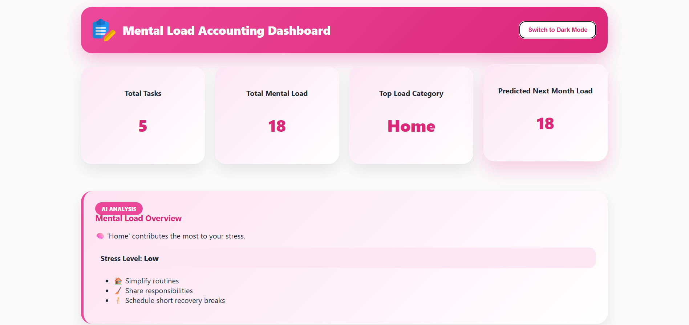
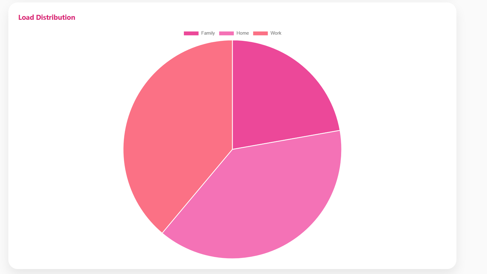
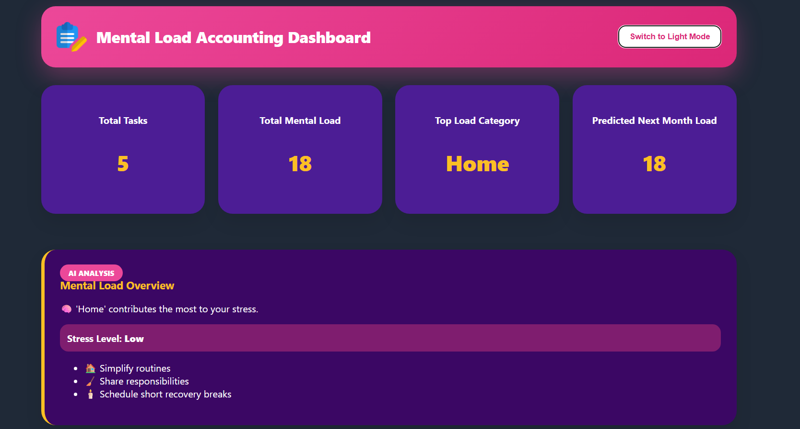

# Mental Load Accounting

Mental Load Accounting is a web app to track, analyze, and visualize tasks and workload distribution using Python, Flask, and SQLite.

## Features
- Bar & pie charts
- Dark mode
- AI-based insights
- Task management
- PDF export

## How to Run
1. Download and unzip the project
2. Install dependencies with: pip install -r requirements.txt
3. Run app.py: python app.py
4. Open browser at http://127.0.0.1:5000

5. ## 📸 Project Screenshots

### Dashboard

### Pie Chart Analysis

### Task Table View

### Dark Mode

